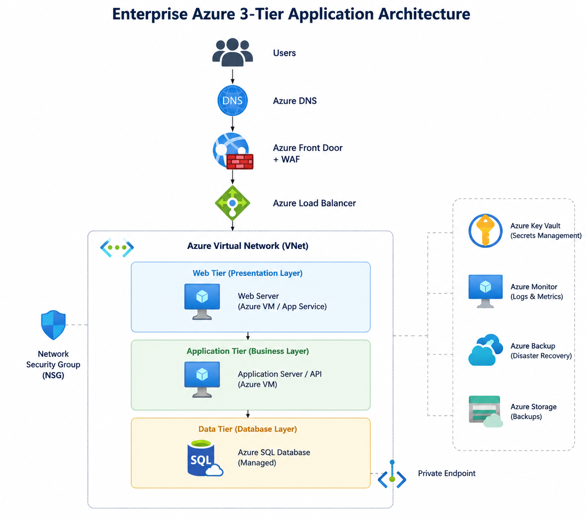

# 🚀 Azure Enterprise 3-Tier Application Architecture

<div align="center">


</div>


# 📌 Project Overview

This project demonstrates an **enterprise-grade 3-Tier Application Architecture** designed on Microsoft Azure following modern cloud architecture and DevOps best practices.

The solution focuses on:

✅ High Availability  
✅ Scalability  
✅ Security  
✅ Network Isolation  
✅ Infrastructure Automation  
✅ Monitoring & Disaster Recovery  


---


# 🏗️ Solution Architecture

The following diagram represents the enterprise Azure 3-Tier Application Architecture:



# ☁️ Azure Architecture Components


## 🌐 Networking Layer

- Azure Virtual Network (VNet)
- Public & Private Subnets
- Network Security Groups (NSG)
- Azure DNS
- Private Endpoint


## 🚀 Traffic Management

- Azure Front Door
- Web Application Firewall (WAF)
- Azure Load Balancer


## 🖥 Compute Layer

- Azure Virtual Machines
- Application Hosting
- Web Tier Deployment


## 🗄 Database Layer

- Azure SQL Database
- Secure Database Connectivity
- Private Access


## 🔐 Security Layer

- Azure Key Vault
- Microsoft Defender Integration
- Network Security Rules
- Secure Secrets Management


## 📊 Monitoring Layer

- Azure Monitor
- Log Analytics Workspace
- Application Insights


## 💾 Backup & Recovery

- Azure Recovery Services Vault
- Disaster Recovery Strategy
- Backup Management


---

# 🔄 Application Request Flow
```text
              Users
                |
                |
           Azure DNS
                |
                |
     Azure Front Door + WAF
                |
                |
       Azure Load Balancer
                |
        -----------------
        |               |
    Web Tier       Application Tier
    (VM)              (API)
        |               |
        -----------------
                |
                |
       Azure SQL Database
                |
                |
 Backup | Monitoring | Security
```


---

# 🏗 Infrastructure as Code (Terraform)
```
terraform/

├── main.tf
├── variables.tf
├── outputs.tf
├── network.tf
├── compute.tf
├── loadbalancer.tf
├── frontdoor.tf
├── database.tf
├── storage.tf
├── keyvault.tf
├── monitoring.tf
├── security.tf
└── backup.tf
```


Terraform is used to provision and manage Azure infrastructure using Infrastructure as Code principles.


Project Structure:


---

# ⚙️ CI/CD Pipeline
```
Developer

    |
    |

GitHub Repository

    |
    |

GitHub Actions

    |
    |

Terraform Validate

    |
    |

Terraform Plan

    |
    |

Terraform Apply

    |
    |

Azure Infrastructure Deployment
```


GitHub Actions workflow automates Terraform deployment.


Pipeline Flow:


---
---

# 🏗 Terraform Components

| File | Purpose |
|---|---|
| main.tf | Azure Provider Configuration |
| variables.tf | Input Variables Configuration |
| outputs.tf | Terraform Output Values |
| network.tf | Azure VNet, Subnets, NSG |
| compute.tf | Virtual Machines |
| loadbalancer.tf | Traffic Distribution |
| frontdoor.tf | Global Routing + WAF |
| database.tf | Azure SQL Database |
| storage.tf | Storage & Backup |
| keyvault.tf | Secrets Management |
| monitoring.tf | Azure Monitor & Logs |
| security.tf | Security Controls |
| backup.tf | Backup & Recovery |
---

# 🚀 Terraform Deployment Commands

### Initialize Terraform

```bash
terraform init

# 🚀 Terraform Deployment Commands
### Initialize Terraform

```bash
terraform init
```


### Validate Configuration

```bash
terraform validate
```


### Create Plan

```bash
terraform plan
```


### Deploy Infrastructure

```bash
terraform apply
```


---

# 🔒 Security Implementation


Implemented security practices:


✅ Network segmentation

✅ NSG based traffic control

✅ Secure secret management using Key Vault

✅ WAF protection

✅ Private connectivity

✅ Monitoring and logging


---

# 🛠 Technology Stack


| Technology | Purpose |
|---|---|
| Microsoft Azure | Cloud Platform |
| Terraform | Infrastructure as Code |
| Azure Virtual Network | Network Architecture |
| Azure VM | Compute Layer |
| Azure SQL Database | Database Layer |
| Azure Front Door | Global Traffic Management |
| WAF | Application Security |
| Azure Monitor | Observability |
| GitHub Actions | CI/CD Automation |


---

# 📈 Future Enhancements


- Kubernetes (AKS) deployment
- Azure Container Registry integration
- Blue/Green deployment strategy
- Advanced DevSecOps scanning
- Multi-region disaster recovery


---

# 👨‍💻 Author


## MD Amirul Haque

**Senior Azure DevOps Engineer | Cloud Architect | DevSecOps Specialist**


🔗 LinkedIn:

https://www.linkedin.com/in/md-amirul-haque/


---

<div align="center">

### 🚀 Building Secure, Scalable and Automated Cloud Solutions

</div>
